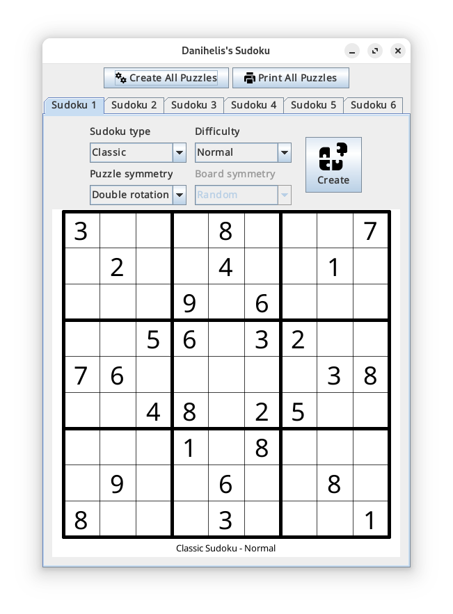
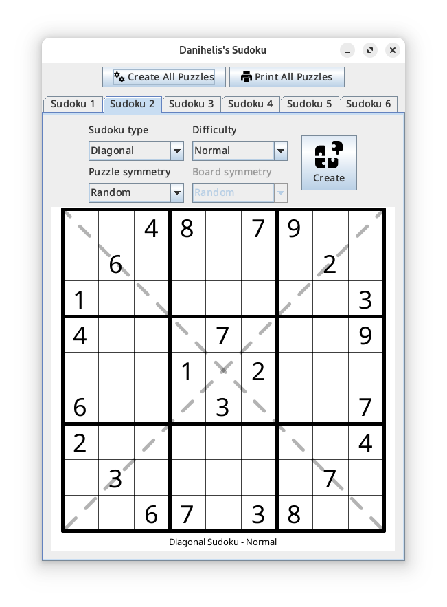
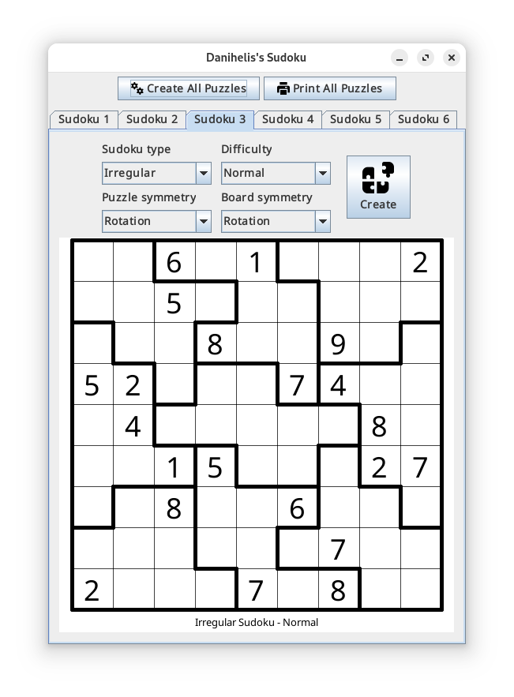

# Danihelis's Sudoku

A Java desktop app to generate and print Sudoku puzzles. See the
[installation](#installation) section below for instructions on how to execute
the program in your machine.

The Java package has three main functionalities:

1. A very simple Sudoku solver for three puzzle flavors: **classic**, with the
   usual Sudoku rules; **diagonal**, where the main diagonals cannot have
   repeated numbers; and **irregular**, where the boxes containing nine numbers
   are deformed shapes instead of 3 by 3 squares.

2. A puzzle generator for each type of Sudoku flavor. It creates puzzles for
   three different levels: **easy** puzzles can be solved by simply applying the
   game rules; **normal** puzzles must be solved using some deduction techniques
   (those implemented in the app); **hard** puzzles must be solved using more
   advanced techniques (they are not implemented in the app).

3. A GUI to create and print the puzzles. You can configure up to six puzzles in
   a single page, each one randomly generated from the input settings. You can
   download a [PDF sample here](docs/sample.pdf).


## Screenshots

Below are some screenshots from the app, showcasing each different puzzle type.






## Installation

The app was developed using Open JDK 23. To execute the app, you must first 
compile the source code into a jar file. You must have installed the latest 
version of [Java](https://www.oracle.com/java/technologies/downloads/) and
[Ant](https://ant.apache.org/). Once they are installed, execute the following
commands in a terminal:

```bash
# Download the repository
git clone https://github.com/danihelis/sudoku.git
cd sudoku

# Compile the source code
ant

# Run the app
java -jar dist/sudoku.jar
```


## License

This program is a free software licensed under
[GNU General Public License](https://www.gnu.org/licenses/).
